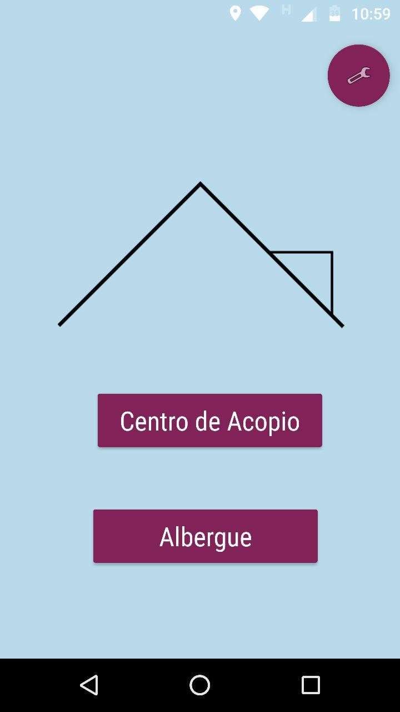
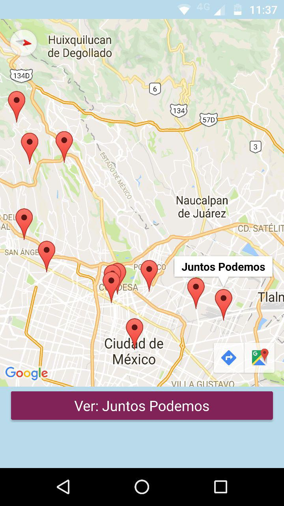
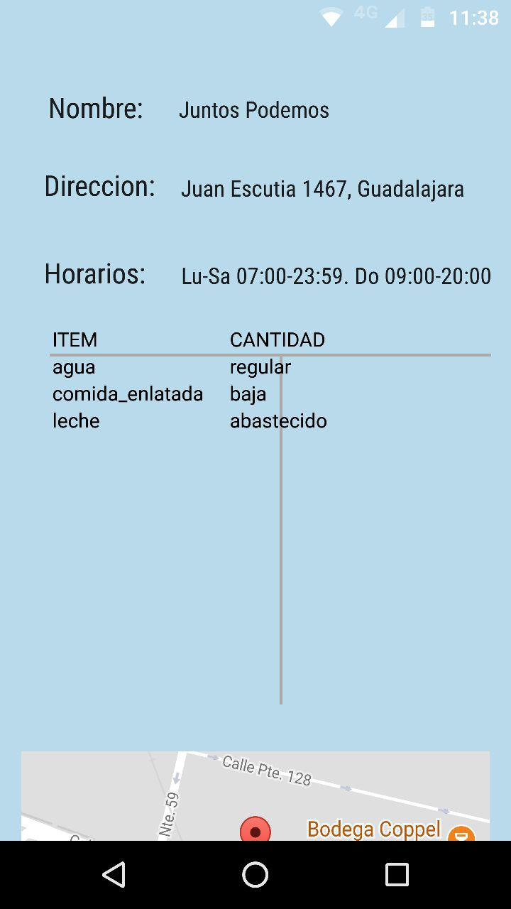
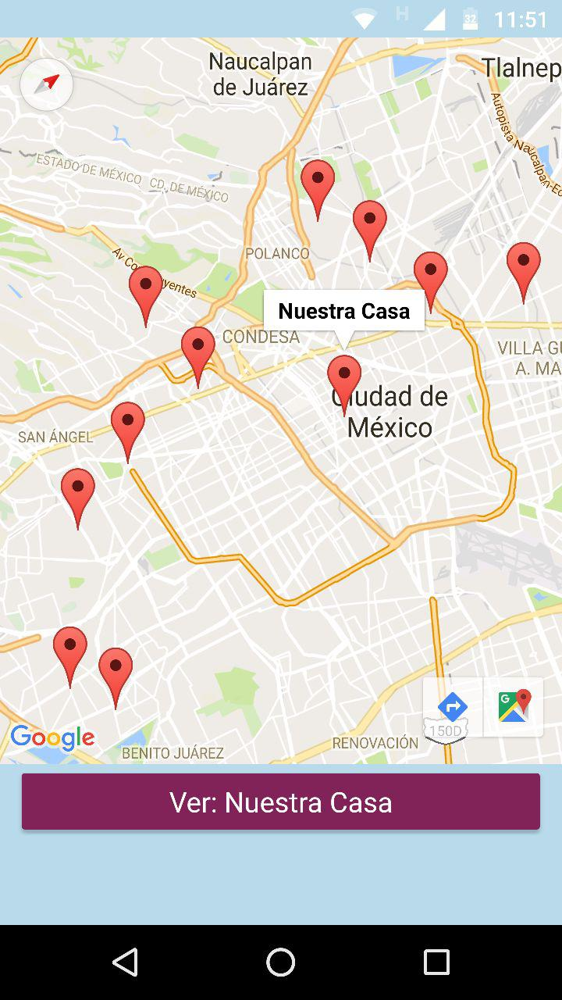
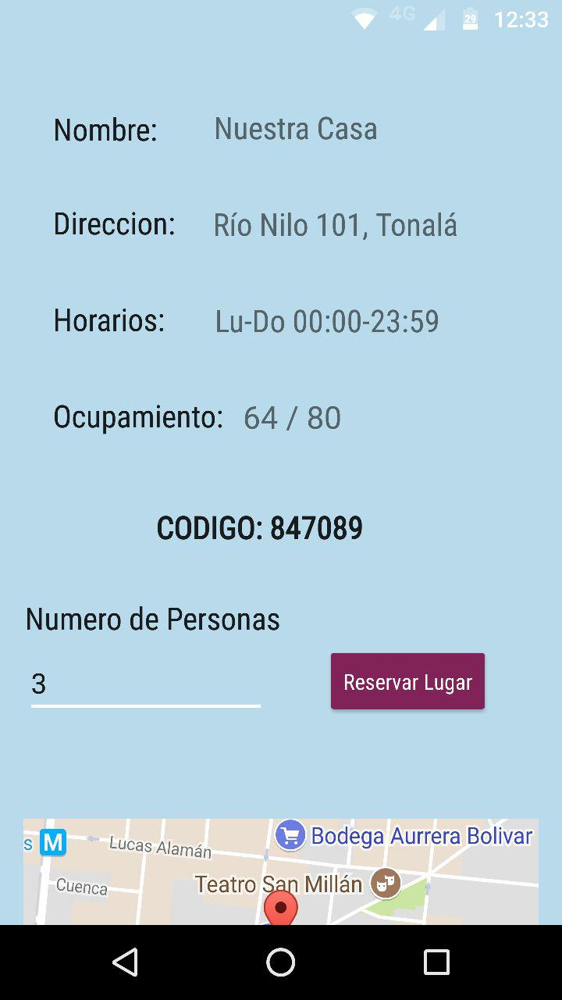
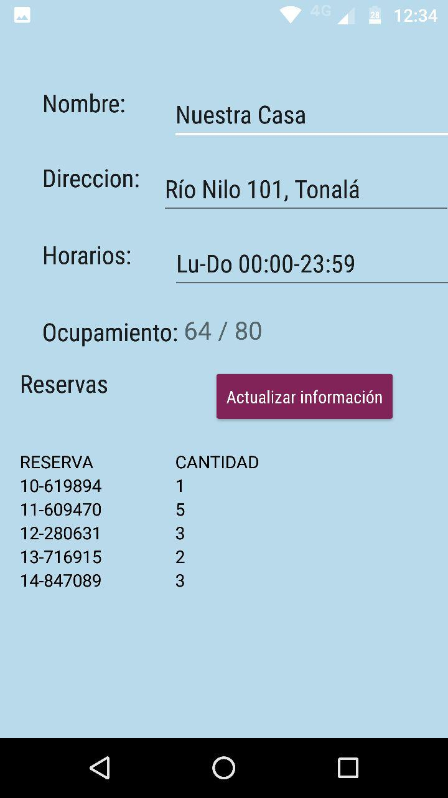

# Shelter Me
Mobile android app for finding nearby shelters and storage centers in emergency situations.

## Purpose
The goal for this app is to help people see how occupied nearby shelters are and make a reservation for however big their group is. People can also see what items nearby storage centers are missing, so that these are taken care of.

## Overall Description
Upon opening the app, this screen allows people to look for either shelters or storage centers:
 
  
 
Next, a map will display either all shelters or all storage centers. Storage centers map:
 
  
 
People can see full details for any given storage center, incluiding which items they need more of:
 
  
 
Shelters Map:
 
  
 
People can see full details for any given shelter, incluiding its capacity. They can also make a reservation from here for all the people in their group, for which they receive a reservation code:
 
  
 
Also, administrators can login from the welcome screen and manage the information for their shelter or storage center. Shelter administrators can see a list of all recent resevations people have made, and for how many people. When each of these reservation owners arrive and they have a reservation, they should just for their reservation code and see if it's on the list.
 
  
 

## Built by:
- Carlos Martell - @carlosmartell97
- Jesús Álvarez - @chuyalvarez
- Lucía Velasco - @luciavg
